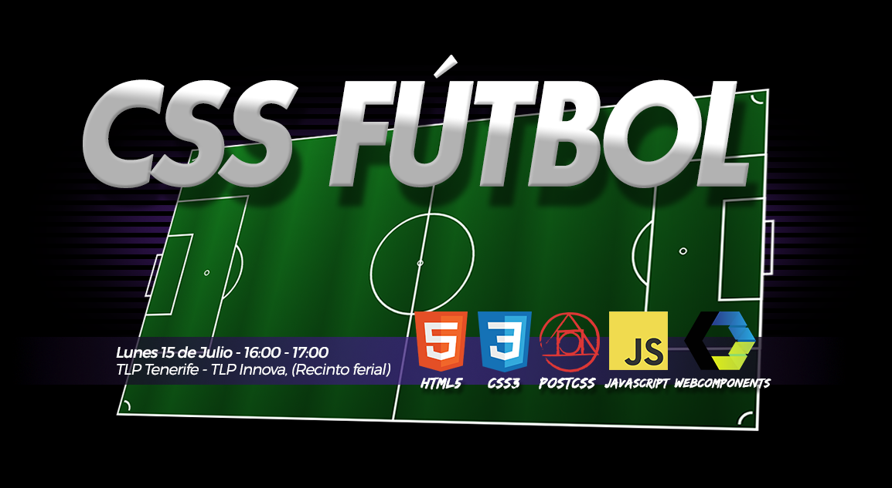

# CSS Fútbol

Talk for TLP Tenerife 2019

## Used technologies

- HTML5/CSS3
- Javascript ES6+ (Babel): <https://babeljs.io/>
- Web Components (v1)
- Parcel: <https://parceljs.org/>
- PostCSS: <https://postcss.org/>
  - Autoprefixer: <https://github.com/postcss/autoprefixer>
  - Preset Env: <https://preset-env.cssdb.org/>
- ESLint: <https://eslint.org/>
- StyleLint: <https://stylelint.io/>

## Getting Started

1. git clone <https://github.com/ManzDev/css-futbol>
2. cd css-futbol
3. sudo npm install -g parcel-bundler
4. npm install
